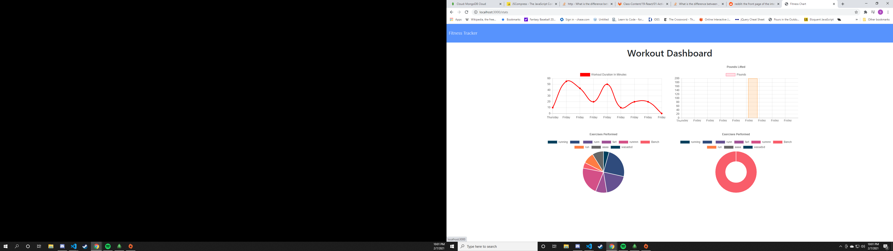

# fitnessTracker# Quiet Sands: Help in the New Year

## Description
Fitness Tracker that helps track data over a period of time.

## Table of Contents

* [Description](#description)
* [Installation](#installation)
* [Usage](#usage)
* [Contributing](#contributing)
* [License](#license)
* [Question](#questions)

## Installation
Install necessary dependencies with npm i command.

## Usage
Application requiring npm packages express, mongoose, morgan and path.

## Screenshot

## Contributing
Seth Klusmire

## License
MIT

## Links
https://github.com/sethklusmire/fitnessTracker

## Questions
Email and Github profiles: [sethklusmire@gmail.com](sethklusmire@gmail.com)

https://github.com/sethklusmire 
